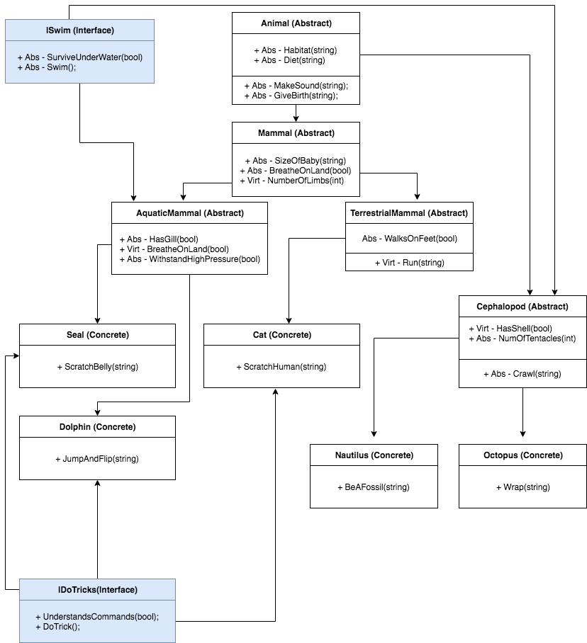

# Zoo

Sample zoo to practice principles of OOP and Interfaces.

An interface contains signatures  of methods and properties. When a class implements an interface, they must implement the properties and methods of an interface, as the relationship between the two is like a 'contract'.

## OOP Principles

OOP (Object Oriented Programming) is a language model organized around objects. The four basics of OOP are Polymorphism, Encapsulation, Abstraction, and Inheritance.

Inheritance : Enables you to create new classes that reuse and modify the behavior that is defined in other classes (Base class). For example, a base class could be Animal, while other classes you create can inherit properties and behaviors from the parent class (class Cat, class Donkey).

Polymorphism: A base class can have set properties and methods, but can be used interchangeably for different actions and purposes.

Abstraction: Allows you to create classes that are incomplete and needs to be implemented from a derived class. An abstract class cannot be instantiated.

Encapsulation: Basically means that a group of methods and/or properties are grouped as a single unit.

## Interfaces in the project:

- ISwim
> Multiple classes here can swim, and I wanted to implement these interfaces on my abstract parent classes and some concrete classes.

- IDoTricks
> Multiple classes can do tricks. Interfaces support inheritance.

## Diagram

